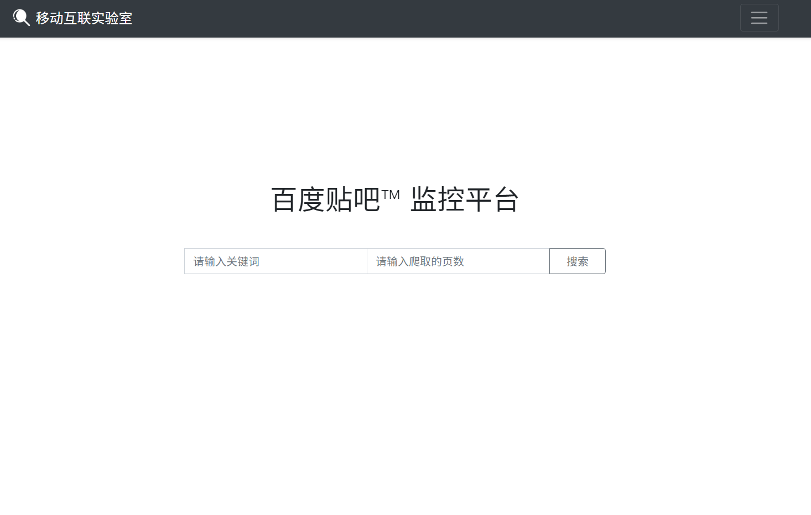
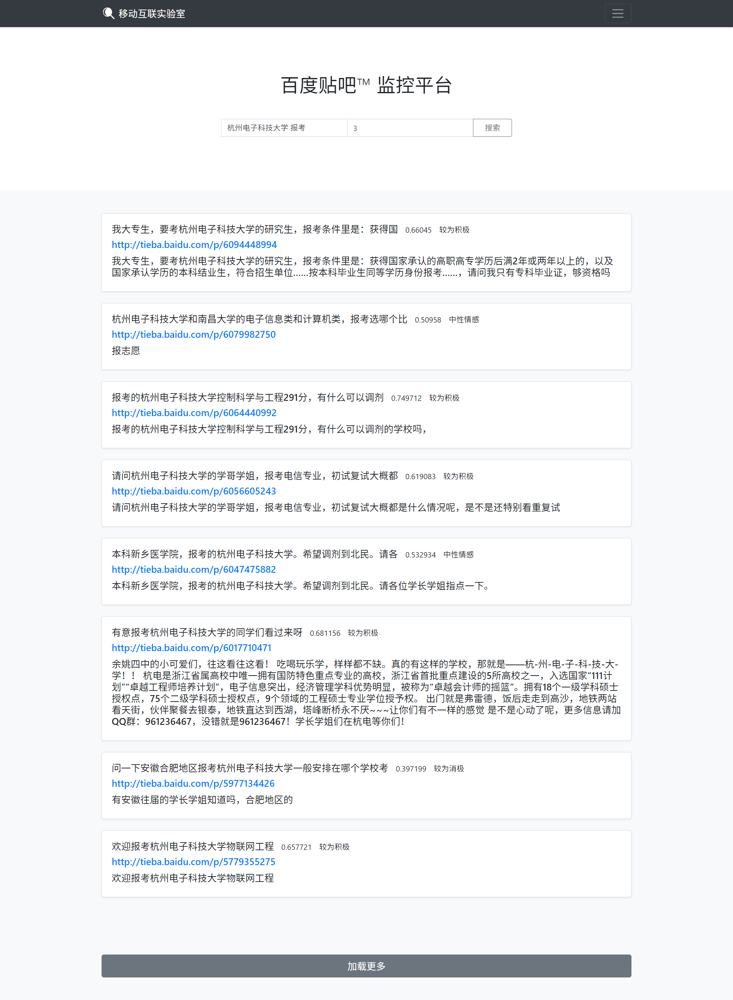

# 百度贴吧™监控平台


> 分工
>
> 李：爬虫，情感分析
>
> 丁：后端，前端展示

## 一、目标需求

1. 开发一个爬虫，可以爬取“百度贴吧™”平台下指定关键字的帖子。
2. 将爬虫爬取到的内容配合百度的情感分析接口API，对情感等级进行打分。
3. 构建一个前端，包含搜索框和搜索按钮，输入需要检索的关键字，返回爬虫爬取的内容，情感分析接口返回的情感等级和分值。


***

## 二、爬虫实现

### 百度贴吧主题帖爬取部分

**简要爬取逻辑**

* 根据关键词搜索全吧内容，返回指定前几页，获取每一页所有文章链接

* 对于每一页的每一篇文章，利用`BeautifulSoup`获取作者，标题，内容等信息，返回`JSON`格式

**详细代码：Python** 

```python
from bs4 import BeautifulSoup
import requests
import re
import random
import json
import time
from urllib.parse import quote

headers = {
    'User-Agent': 'Mozilla/5.0 (Macintosh; Intel Mac OS X 10_13_3) AppleWebKit/537.36 (KHTML, like Gecko) Chrome/65.0.3325.162 Safari/537.36'
}


def pause():
    '''
    延迟一到两秒
    '''
    # sleepTime = random.randint(100, 2000) * 1.0 / 1000
    # 延迟0.1-2秒
    sleepTime = 0.1
    time.sleep(sleepTime)


def make_up_url(url_prefix, url_suffix, keyword):
    """
    组装url
    url_prefix:前缀
    url_suffix:后缀
    keyword:关键词
    网址用的是百分号编码
    """
    return url_prefix + quote(keyword) + url_suffix


def get_url_list_of_one_page(origin_url, page=0):
    """
    获取某页所有的链接
    拼装每一页实际网址并请求
    origin_url: 得到的网址
    page: 页数
    """
    # global originUrl
    # url = originUrl + str(page*50)
    url = origin_url + str(page + 1)
    html = requests.get(url, headers=headers)
    pattern = r'href="(/p/[0-9]*)[^ ]'
    # 获取每一页上所有文章的网址
    article_list = re.findall(pattern, html.text)

    for i in range(len(article_list)):
        article_list[i] = "http://tieba.baidu.com" + article_list[i]
    return article_list


def get_soup_of_article(article_url, page=1):
    """
    获取每一页soup对象
    """
    url = article_url + "?pn="
    html = requests.get(url + str(page), headers=headers)
    soup = BeautifulSoup(html.text, 'lxml')
    return soup


def get_title(article):
    """
    获取标题
    随便哪页都能获取，选第一页
    """
    soup = get_soup_of_article(article, 1)
    title = soup.find(class_='core_title_txt')['title'].strip()
    return title


def get_main_content_first_floor_advance(article_soup):
    # 返回列表
    content_district = article_soup.find(class_="d_post_content_firstfloor")
    # 因为是第一楼这样子定位更精确更快
    content = content_district.find(class_=['d_post_content', 'j_d_post_content'])
    # 获得内容
    if (content != None):
        content = content.text.strip()
    else:
        content = ""
    # pause()
    time.sleep(0.1)
    return content


def get_list_first_floor_advance(page_want, keyword):
    '''
    根据关键词和指定页数爬取
    page_want:爬搜索结果的几页
    keyword:关键词
    '''
    result = []
    url_prefix = "http://tieba.baidu.com/f/search/res?ie=utf-8&isnew=1&kw=&qw="
    url_suffix = "&un=&rn=10&pn=0&sd=&ed=&sm=1&only_thread=1&pn="
    origin_url = make_up_url(url_prefix, url_suffix, keyword)
    for page in range(page_want):  # 逐页爬取
        article_list = get_url_list_of_one_page(origin_url, page)
        for article in article_list:
            soup = get_soup_of_article(article)
            title = get_title(article)
            one_article_info_dict = {}
            one_article_info_dict['firstFloorContent'] = get_main_content_first_floor_advance(soup)
            one_article_info_dict['title'] = title
            one_article_info_dict['href'] = article
            # one_article_info_dict['positive_prob'] = 0
            # one_article_info_dict['confidence'] = 0
            # print(oneArticleDict)
            result.append(one_article_info_dict)
        print("page", page + 1, "process done")

    print("All first floor comment get done")
    return result


def quick_get_first_floor_advance(page_order, keyword):
    """
    根据关键词和指定页数爬取
    page_want:爬搜索结果的几页
    keyword:关键词
    """
    result_list = []
    url_prefix = "http://tieba.baidu.com/f/search/res?ie=utf-8&isnew=1&kw=&qw="
    url_suffix = "&un=&rn=10&pn=0&sd=&ed=&sm=1&only_thread=1&pn="
    origin_url = make_up_url(url_prefix, url_suffix, keyword)
    article_list = get_url_list_of_one_page(origin_url, page_order)
    print(article_list)
    for article in article_list:
        soup = get_soup_of_article(article)
        title = get_title(article)
        one_article_info_dict = {}
        one_article_info_dict['firstFloorContent'] = get_main_content_first_floor_advance(soup)
        one_article_info_dict['title'] = title
        one_article_info_dict['href'] = article
        # one_article_info_dict['positive_prob'] = 0
        # one_article_info_dict['confidence'] = 0
        # print(oneArticleDict)
        result_list.append(one_article_info_dict)
        # print(result_list)
    print("page : ", page_order, " process done")
    print(result_list)
    # result_json = json.dumps(result_list).encode('UTF-8')
    print("All first floor comment get done")
    return result_list


if __name__ == '__main__':
    print('开始爬取')

    # result = get_list_first_floor_advance(1, "杭州电子科技大学 三位一体")
    # print(result)
    # for res in result:
    #     print(res['firstFloorContent'])
    #     print(res['title'])
    #     print(res['href'])

    result = quick_get_first_floor_advance(page_order=1, keyword='浙江大学')
    print(result)
```


***

## 三、情感分析接口API代码

主要逻辑

* 底层封装好一个获得百度`access_token`的库，程序开始前调用这个库
* 请求百度情感分析API，传入待分析词语，拼接成完整请求网址进行请求
* 得到百度传回信息（JSON格式），转换为字典格式后返回

```python
# coding=utf-8
import requests
import SentimentAnalysis.getAccessToken as gat
import json


def analysisJson(content=""):
    # 传入utf-8内容
    # 返回Json

    access_token = gat.get_access_token().strip()

    url_origin = 'https://aip.baidubce.com/rpc/2.0/nlp/v1/sentiment_classify?charset=UTF-8&'

    # url = url_origin + 'access_token='+access_token
    url = "https://aip.baidubce.com/rpc/2.0/nlp/v1/sentiment_classify?access_token=" + access_token  # API

    headers = {
        'content-type': 'application/json',
    }

    text = {"text": content}

    analyze_response = requests.post(url=url, headers=headers, data=json.dumps(text).encode('utf-8'))
    # print(analyze_response.encoding)
    analyze_response.encoding = 'gbk'
    # 百度文档里面说请求编码是utf-8，传回来的就是utf-8
    # 但我请求utf-8传回来的是gbk
    j_analyze = analyze_response.text
    # 提取正文

    return j_analyze


def analysis_Dict(content=""):
    # 传入utf-8内容
    # 返回字典

    access_token = gat.get_access_token().strip()

    url_origin = 'https://aip.baidubce.com/rpc/2.0/nlp/v1/sentiment_classify?charset=UTF-8&'

    # url = url_origin + 'access_token='+access_token
    url = "https://aip.baidubce.com/rpc/2.0/nlp/v1/sentiment_classify?access_token=" + access_token  # API

    headers = {
        'content-type': 'application/json',
    }

    text = {"text": content}

    analyze_response = requests.post(url=url, headers=headers, data=json.dumps(text).encode('utf-8'))
    # print(analyze_response.encoding)
    analyze_response.encoding = 'gbk'
    # 百度文档里面说请求编码是utf-8，传回来的就是utf-8
    # 但我请求utf-8传回来的是gbk
    d_analyze = json.loads(analyze_response.text)
    # 提取正文并把Json转换成字典

    return d_analyze


res = analysis_Dict("apple is great")
print(res)
```

返回的结果如下：

```json
{'log_id': 9058596641540229681, 'text': 'apple is great', 'items': [{'positive_prob': 0.532347, 'confidence': 0.353058, 'negative_prob': 0.467653, 'sentiment': 1}]}
```


***

## 四、后台构建

后端构建使用 Flask 搭建 

```python
from flask import Flask, request, render_template, redirect, url_for, make_response
from tiebaSpider import spiderOnlyFirstFloorAdvance
from SentimentAnalysis import Analysis
from flask_bootstrap import Bootstrap
import json

app = Flask(__name__)

bootstrap = Bootstrap(app)


@app.route('/', methods=['GET', 'POST'])
def index():
    users = []
    if request.method == 'GET':
        return render_template('simple_index.html', says=users)

    else:
        users.clear()  # 清除输入框中的内容，方便下一次查询时输入

        context = request.form.get('context')  # 获取需要查询的文本关键字
        page = request.form.get('page')  # 获取需要查询的帖子页面数
        print(context)
        print(page)
        result = spiderOnlyFirstFloorAdvance.get_list_first_floor_advance(page_want=int(page), keyword=context)
        for res in result:
            print(res['firstFloorContent'])
            emotion = Analysis.analysis_Dict(res['title'])['items'][0]['positive_prob']  # 调用百度的”情感分析API“，返回文本的情感极性值
            if emotion >= 0.800:  # 对返回的值进行一个登记划分，以 20% 为一档
                emotion_type = "非常积极"
            elif 0.600 <= emotion < 0.800:
                emotion_type = "较为积极"
            elif 0.400 <= emotion < 0.600:
                emotion_type = "中性情感"
            elif 0.200 <= emotion < 0.400:
                emotion_type = "较为消极"
            elif emotion < 0.200:
                emotion_type = "非常消极"
            users.append(
                {"text": res['firstFloorContent'], "title": res['title'], "href": res['href'], "emotion": emotion_type})

        return redirect(url_for('index'))


@app.route('/tieba', methods=['GET', 'POST'])  # 定义路由(Views)，可以理解为定义页面的URL
def show_tieba_index():
    return render_template('tieba_monitor_index.html', )


@app.route('/weibo', methods=['GET', 'POST'])  # 定义路由(Views)，可以理解为定义页面的URL
def show_weibo_index():
    return render_template('weibo_monitor_index.html', )


@app.route('/tiebaInfo', methods=['GET', 'POST'])
def get_tieba_info():
    """
    调用前面写好的爬虫方法 和 情感分析接口
    对情感分析返回的值，自己手动设置一个阶梯，按照 20% 来划分层次
    等待改进的点：每次爬取的时间比较长，需要等待一段时间才能返回结果
    :return:
    """
    page = int(request.args.get('page'))  # 别问这个啥用处，我也不清楚，胶水粘起来的，能跑……
    keyword = request.args.get('keyword')
    result = spiderOnlyFirstFloorAdvance.get_list_first_floor_advance(page_want=page, keyword=keyword)
    # result = spiderOnlyFirstFloorAdvance.get_json_first_floor_advance(page_order=page, keyword=keyword)
    for res in result:
        print(res['firstFloorContent'])
        emotion = Analysis.analysis_Dict(res['title'])['items'][0]['positive_prob']  # 调用百度的”情感分析API“，返回文本的情感极性值
        if emotion >= 0.800:  # 对返回的值进行一个登记划分，以 20% 为一档
            emotion_type = "非常积极"
        elif 0.600 <= emotion < 0.800:
            emotion_type = "较为积极"
        elif 0.400 <= emotion < 0.600:
            emotion_type = "中性情感"
        elif 0.200 <= emotion < 0.400:
            emotion_type = "较为消极"
        elif emotion < 0.200:
            emotion_type = "非常消极"
        res['emotion_type'] = emotion_type
        res['emotion'] = emotion

    result_json = json.dumps(result)
    print(result_json)
    rst = make_response(result_json)
    rst.headers['Access-Control-Allow-Origin'] = '*'
    print(rst)
    return rst


# 加载更多部分请求的url路由
@app.route('/tiebaInfoLoadMore', methods=['GET', 'POST'])
def get_info_new():
    """
    调用前面写好的爬虫方法 和 情感分析接口
    对情感分析返回的值，自己手动设置一个阶梯，按照 20% 来划分层次
    :return:
    """
    page = int(request.args.get('page'))  # 别问这个啥用处，我也不清楚，胶水粘起来的，能跑……
    keyword = request.args.get('keyword')
    result = spiderOnlyFirstFloorAdvance.quick_get_first_floor_advance(page_order=page, keyword=keyword)
    for res in result:
        print(res['firstFloorContent'])
        emotion = Analysis.analysis_Dict(res['title'])['items'][0]['positive_prob']  # 调用百度的”情感分析API“，返回文本的情感极性值
        if emotion >= 0.800:  # 对返回的值进行一个登记划分，以 20% 为一档
            emotion_type = "非常积极"
        elif 0.600 <= emotion < 0.800:
            emotion_type = "较为积极"
        elif 0.400 <= emotion < 0.600:
            emotion_type = "中性情感"
        elif 0.200 <= emotion < 0.400:
            emotion_type = "较为消极"
        elif emotion < 0.200:
            emotion_type = "非常消极"
        res['emotion_type'] = emotion_type
        res['emotion'] = emotion

    result_json = json.dumps(result)
    print(result_json)
    rst = make_response(result_json)
    rst.headers['Access-Control-Allow-Origin'] = '*'
    print(rst)
    return rst

if __name__ == '__main__':
    app.run(debug=True, )
```


***

##  五、前端构建

### HTML 部分代码

**简述**

* 样式部分使用 Bootstrap 来搭建。

* 主要内容是一个搜索框，键入需要搜索的关键词信息。

* 一个页数框，用来输入需要爬取的页数。

* 一个搜索按钮，按下后开始向后端请求数据。

* 一个加载更多的按钮，在页面开始时隐藏，在js返回信息到HTML后，显示该按钮。

```html
<!DOCTYPE html>
<html lang="zh">

<head>
    <meta charset="utf-8"/>
    <meta name="viewport" content="width=device-width, initial-scale=1, shrink-to-fit=no"/>
    <title>百度贴吧™ 监控平台</title>
    <link rel="shortcut icon" href="../static/my_img/favicon.ico" type="image/x-icon"/>
    <link rel="stylesheet" href="../static/bootstrap-4.1.3-dist/css/bootstrap.css"/>
    <link href="../static/my_css/index.css" rel="stylesheet"/>
</head>

<body>
<header>
    <div class="collapse bg-dark" id="navbarHeader">
        <div class="container">
            <div class="row">
                <div class="col-sm-8 col-md-7 py-4">
                    <h4 class="text-white">介绍</h4>
                    <p class="text-muted">
                        本服务可以通过指定关键词，搜索关键词在百度贴吧™中的内容，辅以AI平台语义分析，可以实现实时的监控。
                        服务首先通过调用 “百度贴吧” 的搜索服务来获取内容，再经过python程序处理内容，
                        对内容进行语义分析，得出其情感取向，在本页面中展示。
                    </p>
                </div>
                <div class="col-sm-4 offset-md-1 py-4">
                    <h4 class="text-white">资料</h4>
                    <ul class="list-unstyled">
                        <li><a target="_blank"
                               href="https://ryanligod.github.io/2018/11/15/2018-11-15%20%E4%BD%BF%E7%94%A8%20jQuery%20%E5%AE%9E%E7%8E%B0%20Solr%20%E6%90%9C%E7%B4%A2%E7%9A%84%E5%89%8D%E7%AB%AF%E9%A1%B5%E9%9D%A2%E5%B1%95%E7%A4%BA/"
                               class="text-white">本页面的设计讲解</a></li>
                        <li><a target="_blank" href="https://github.com/dingjianhub/AnalysisPublicOpinionTieba"
                               class="text-white">本项目的
                            Github 地址</a></li>
                        <li><a target="_blank" href="https://github.com/RyanLiGod/solr-web" class="text-white">本项目参考的前端原作者的
                            Github 地址</a></li>
                        <li><a target="_blank" href="https://callmejiagu.github.io/categories/Solr/" class="text-white">”callmejiagu“的
                            Solr 讲解</a></li>
                        <li><a target="_blank" href="https://getbootstrap.com/" class="text-white">Bootstrap 4</a></li>
                        <li><a target="_blank" href="https://jquery.com/" class="text-white">jQuery</a></li>
                    </ul>
                </div>
            </div>
        </div>
    </div>
    <div class="navbar navbar-dark bg-dark shadow-sm">
        <div class="container d-flex justify-content-between">
            <a class="navbar-brand align-items-center" href="#">
                
                移动互联实验室
            </a>
            <button class="navbar-toggler" type="button" data-toggle="collapse" data-target="#navbarHeader"
                    aria-controls="navbarHeader"
                    aria-expanded="false" aria-label="Toggle navigation">
                <span class="navbar-toggler-icon"></span>
            </button>
        </div>
    </div>
</header>

<main role="main">
    <section class="jumbotron text-center not-search">
        <div class="container">
            <h1 class="jumbotron-heading">百度贴吧™ 监控平台</h1>
            <div class="input-group mt-5 mb-3 position-relative">
                <input type="text" id="keyword" class="form-control keyword-input" placeholder="请输入关键词"
                       autocomplete="off"
                       aria-describedby="button-addon2"/>
                <input type="text" id="page" class="form-control keyword-input" placeholder="请输入爬取的页数"
                       autocomplete="off"
                       aria-describedby="button-addon2"/>
                <div class="input-group-append">
                    <button id="searchInfo" class="btn btn-outline-secondary px-4" type="button">搜索</button>
                </div>
            </div>
        </div>
    </section>

    <div id="resultSection" class="py-5 bg-light">
        <div class="container">
            <div class="row" id="result">
                <!-- 每一条结果将会用jQuery插入到这里 -->
            </div>
        </div>
    </div>

    <div id="readMoreSection" class="py-5 bg-light">
        <div class="container">
            <button id="readMore" type="button" class="btn btn-secondary btn-lg btn-block">加载更多</button>
        </div>
    </div>


</main>

<script src="../static/js/jquery-3.3.1.min.js"></script>
<script src="../static/bootstrap-4.1.3-dist/js/bootstrap.min.js"></script>
<script src="../static/my_js/tieba.js"></script>
</body>

</html>
```


### Javascript 部分代码

**代码逻辑**

* js向后端发起请求，尝试获取爬虫爬取到的帖子信息。

* 对于获取到的信息，将其包装成HTML，插入到HTML部分中，在页面上显示出来。

```javascript
var page_g = 1;

$(document).ready(function () {
    // 页面刚开始隐藏搜索结果的部分
    $("#resultSection").hide();

    $("#readMoreSection").hide();

    // id为searchInfo的按钮按下触发searchInfo()方法
    $("#searchInfo").click(function () {
        searchInfo(
            page = $("#page").val(),
            keyword = $("#keyword").val());
        page_g = parseInt($("#page").val());
        console.log("开始时的page_g的值为 ： "+page_g)
    });

    $("#readMore").click(function () {
        page_g = page_g + 1;
        loadMore(
            page = page_g,
            keyword = $("#keyword").val());
        console.log("按下加载更多后的page_g的值为 ： "+page_g)
    });

});


// 在按下enter键的时候就搜索
$(document).keyup(function (event) {
    if (event.keyCode == 13) {
        searchInfo(
            page = $("#page").val(),
            keyword = $("#keyword").val());
    }
});


function searchInfo(page, keyword) {
    // 首先清空result中的内容以便内容填入
    $("#result").empty();
    $.ajax({
        //url: "http://localhost:5000/tiebaInfo?page=" + page + "&keyword=" + keyword,
        url: "http://localhost:5000/tiebaInfo?page=" + page + "&keyword=" + keyword,
        //url: "http://localhost:5000/info",
        type: "GET",
        dataType: "json",
        success: function (result) {
            // 循环输出json对象result中的键值对
            $.each(result, function (i) {
                // 将返回的结果包装成HTML
                resultItem =
                    `
                        <div class='col-md-12 mb-4'>
                            <div class='card mb-12 shadow-sm'>
                                <div class='card-body'>
                                    <h5>` + result[i].title + `
                                        <small style='margin-left: 10px'>` + result[i].emotion + `</small> 
                                        <small style='margin-left: 10px'>` + result[i].emotion_type + `</small>
                                    <h5>
                                    <p class='text-muted' style='margin-bottom: 0.5em'>` + result[i].href + `</p>
                                    <p class='card-text'>` + result[i].firstFloorContent + `</p>
                                </div>
                            </div>
                        </div>
                    `;
                // 插入HTML到result中
                $("#result").append(resultItem);
            });

            // 搜索完以后让搜索框移上去，带有动画效果
            $("section.jumbotron").animate({
                margin: "0"
            });

            // 显示搜索结果的部分
            $("#resultSection").show();

            // 显示加载更多的按钮
            $("#readMoreSection").show();

            // error: function (error) {
            //     console.log(error)
            // }

        }
    });
}


function loadMore(page_g, keyword) {
    // 首先清空result中的内容以便内容填入
    //$("#result").empty();
    $.ajax({
        //url: "http://localhost:5000/tiebaInfo?page=" + page + "&keyword=" + keyword,
        url: "http://localhost:5000/tiebaInfoLoadMore?page=" + page_g + "&keyword=" + keyword,
        //url: "http://localhost:5000/info",
        type: "GET",
        dataType: "json",
        success: function (result) {
            // 循环输出json对象result中的键值对
            $.each(result, function (i) {
                // 将返回的结果包装成HTML
                resultItem =
                    `
                        <div class='col-md-12 mb-4'>
                            <div class='card mb-12 shadow-sm'>
                                <div class='card-body'>
                                    <h5>` + result[i].title + `
                                        <small style='margin-left: 10px'>` + result[i].emotion + `</small> 
                                        <small style='margin-left: 10px'>` + result[i].emotion_type + `</small>
                                    <h5>
                                    <p class='text-muted' style='margin-bottom: 0.5em'>` + result[i].href + `</p>
                                    <p class='card-text'>` + result[i].firstFloorContent + `</p>
                                </div>
                            </div>
                        </div>
                    `;
                // 插入HTML到result中
                $("#result").append(resultItem);
            });

            // 搜索完以后让搜索框移上去，带有动画效果
            // $("section.jumbotron").animate({
            //     margin: "0"
            // });

            // 显示搜索结果的部分
            //$("#resultSection").show();

            // 显示加载更多的按钮
            $("#readMoreSection").show();

            // error: function (error) {
            //     console.log(error)
            // }
        }
    });
}
```


***

## 五、最终效果

启动 `Flask` 部分代码后，在本地浏览器访问 [http://127.0.0.1:5000/tieba](http://127.0.0.1:5000/tieba) ，即可开始检索



尝试检索，在搜索框键入关键字 ： **杭州电子科技大学 报考** ，尝试爬取 3 页信息。

经过一段时间的爬取，页面成功返回了爬取到的信息和情感等级分类。





如果需要获得更多信息，点击 “加载更多” 按钮，爬虫将自动获取下一页的信息。


***

## 六、改进

+ 爬虫的爬取速度较慢，需要等待较长时间才能返回爬取的结果。需要对这个环节进行完善，加快爬取的速度。
  + 可行完善思路
    + 加入多线程，即将网页请求和文本信息提取分成两个线程
    + 利用`yield`一次返回一篇文章的信息，而不是等一页信息全部加载后再显示
    + 优化文本处理速度
+ 爬取的信息源较为单一，只爬取了百度贴吧™，后期需要增加其他平台（微博，知乎）的爬取。
+ 未加入按时间筛选功能
+ 情感状态可用不同颜色高亮，如消极的用红色突出显示（只需要加入CSS样式用class控制）